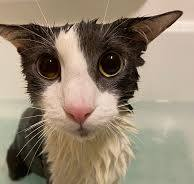
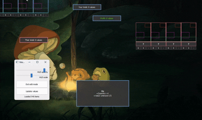
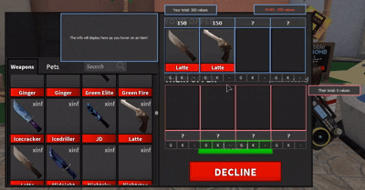

<div align="center">



# SupremeHUD
### An automatic overlay calculator and item scanner for Murder Mystery 2 (Roblox).

<h4>
    <a href="https://i.pinimg.com/236x/b3/a3/fd/b3a3fd01ee45fc0717544383309e5eef.jpg">these things</a>
  <span> · </span>
    <a href="https://static.wikia.nocookie.net/bones-lore/images/4/4d/Soggy.png/revision/latest/scale-to-width-down/1200?cb=20260423222338">make the readme</a>
  <span> · </span>
    <a href="https://i.pinimg.com/736x/bc/56/a6/bc56a648f77fdd64ae5702a8943d36ae.jpg">look better</a>
  <span> · </span>
    <a href="https://pbs.twimg.com/media/F0SThFKaAAEzQoH.jpg">imo</a>
</h4>

</div>

<details>
  <summary><h1>📚 Table of Contents</h1></summary>

  - [Features](#feat)
  - [Installation & Setup](#inst)
  - [Usage](#usage)
  - [Troubleshooting](#troubleshooting)
  - [License](#license)
  - [Acknowledgements](#ack)

</details>

## <a id="feat"></a> ✨ Features
- **Auto-screen scanning:** Uses OCR (Tesseract) and OpenCV to recognize item names and quantities (`x2`, `x3`, etc.).
- **Loads Current Prices:** Parses data from [Supreme Values](https://supremevalues.com/).
- **Interactive HUD:** Fully transparent overlay, tooltips on hover, and the ability to manually adjust slots.

## <a id="inst"></a> 💾 Installation & Setup
- **SupremeHUD** requires **Tesseract** to work.

### **Install [Tesseract OCR](https://github.com/tesseract-ocr/tesseract/releases)** on your system. If you decide to install Tesseract in a different location, **you can specify the path** to Tesseract in `config.json`:

``` json
{
    "tesseract": "/path/to/tesseract.exe"
}
```

## <a id="usage"></a> 💻 Usage

 Run the executable — a settings window and an overlay will appear on the screen.

### Click “**Enter edit mode**” in the settings window:

- Dotted borders for the scan subregions will appear on the overlay.
- **Drag the blocks with your mouse** to adjust them to fit the trade window.
- Use the “**HUD scale**” and “**HUD opacity**” sliders to adjust the size and transparency.

### Click “**Exit edit mode**”:

- The overlay will switch to **pass-through mode** (clicks will pass through it into the game).

<div align="center">



</div>


## <a id="troubleshooting"></a> 👾 Troubleshooting:
### If the item has both **Gun** and **Knife** versions (like **Latte**), press the `[G]` or `[K]` button below the slot.
- Press `[-]` to **reset** the manual setting.

<div align="center">



###### yes, i used a modded mm2 ;-;

</div>

## <a id="license"></a> ⚖️ License
Distributed under the **MIT License**. See `LICENSE.txt` for more information.

## <a id="ack"></a> ❓ Acknowledgements
* **[Supreme Values](https://supremevalues.com/)** — The MM2 item values database and statistics.
* **[Tesseract OCR](https://github.com/tesseract-ocr/tesseract)** — The optical character recognition engine used for screen parsing.
* **[PyQt5](https://pypi.org/project/PyQt5/) & [OpenCV](https://opencv.org/)** — GUI overlay components and image processing algorithms.

### Supreme Values is developed by *hdmi*. All product names, logos, and trademarks belong to their respective owners. This project is an independent overlay tool and is not affiliated with or endorsed by Roblox Corporation, Nikilis or Supreme Values dev team. The program is an external graphical overlay and does not interfere with the Roblox gameplay. 